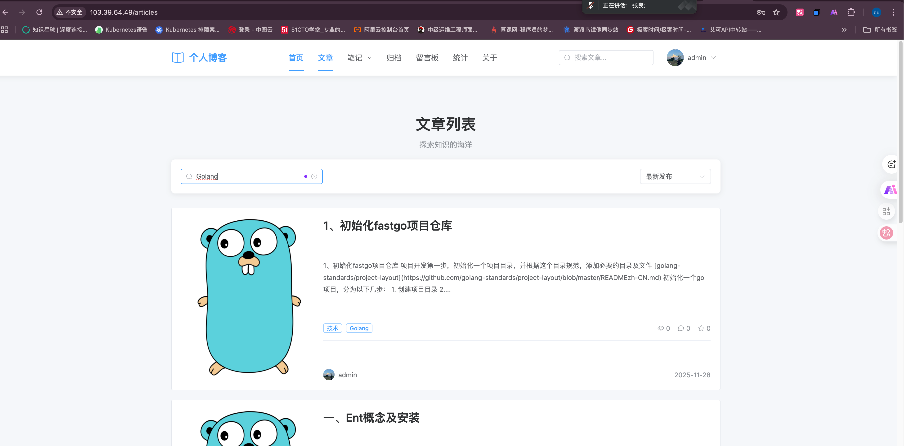
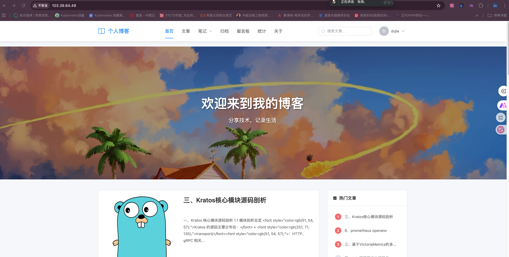
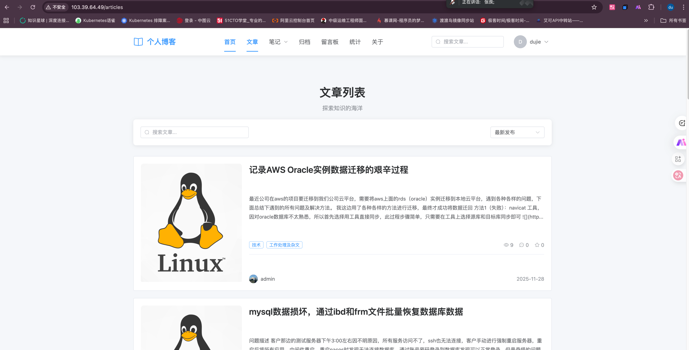
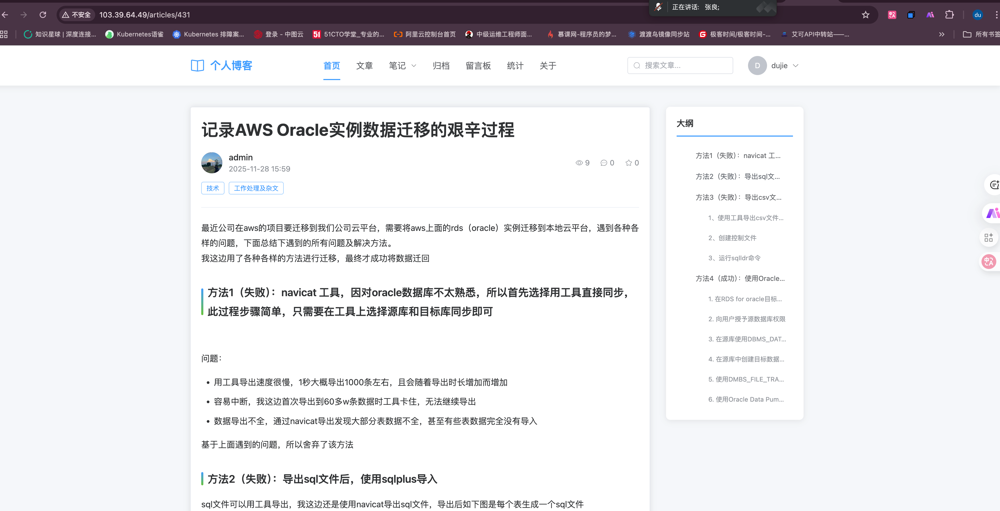
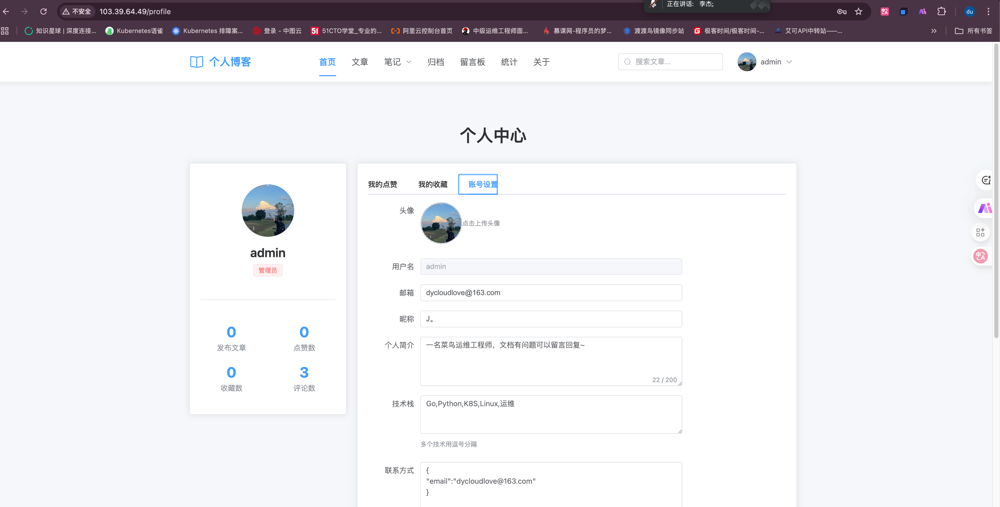

# Leaf UI 博客前端

基于 Vue 3 + Element Plus 构建的现代化博客系统前端，支持文章发布、笔记分类、留言互动等功能。

## 📑 目录

- [✨ 特性亮点](#-特性亮点)
- [快速开始](#快速开始)
- [项目展示](#项目展示)
- [技术栈](#技术栈)
- [项目结构](#项目结构)
- [功能特性](#功能特性)
  - [已实现功能](#已实现功能)
- [安装依赖](#安装依赖)
- [开发模式](#开发模式)
- [生产构建](#生产构建)
- [预览生产构建](#预览生产构建)
- [API 配置](#api-配置)
- [环境要求](#环境要求)
- [主要依赖版本](#主要依赖版本)
- [开发说明](#开发说明)
  - [路由配置](#路由配置)
  - [状态管理](#状态管理)
  - [API 调用](#api-调用)
  - [样式规范](#样式规范)
- [后端接口要求](#后端接口要求)
  - [认证接口](#认证接口)
  - [文章接口](#文章接口)
  - [评论接口](#评论接口)
  - [标签和章节接口](#标签和章节接口-)
  - [统计接口](#统计接口-)
  - [用户数据接口](#用户数据接口)
- [浏览器支持](#浏览器支持)
- [部署方式](#部署方式)
  - [裸部署](#裸部署)
  - [Docker 部署](#docker-部署)
  - [Docker Compose 部署](#docker-compose-部署)
  - [Kubernetes 部署](#kubernetes-部署)
- [环境变量配置](#环境变量配置)
  - [开发环境](#开发环境)
  - [生产环境](#生产环境)
- [注意事项](#注意事项)
- [性能优化](#性能优化)
- [许可证](#许可证)

## ✨ 特性亮点

- 🎨 **现代化 UI** - 基于 Element Plus，响应式设计，支持移动端
- 📝 **Markdown 支持** - 完整的 Markdown 渲染，支持代码高亮、锚点、目录
- 📚 **笔记系统** - 支持多级章节目录，方便组织技术笔记
- 📊 **实时统计** - 文章浏览量、在线人数、热门文章排行
- 💬 **互动功能** - 评论、点赞、收藏、留言板
- 🔐 **用户系统** - 注册登录、个人中心、权限控制
- ⚡ **高性能** - Vite 构建，路由懒加载，代码分割

## 快速开始

```bash
# 安装依赖
npm install

# 启动开发服务器
npm run dev

# 访问 http://localhost:3000
```

> **注意**：确保后端服务已在 http://localhost:8888 启动

## 项目展示





## 技术栈

- **框架**: Vue 3 (Composition API)
- **路由**: Vue Router 4
- **状态管理**: Pinia
- **UI 组件库**: Element Plus
- **HTTP 客户端**: Axios
- **Markdown 渲染**: markdown-it + markdown-it-anchor + markdown-it-highlightjs
- **代码高亮**: highlight.js
- **日期处理**: dayjs
- **构建工具**: Vite

## 项目结构

```
leaf-ui-frontend/
├── package.json              # 项目依赖配置
├── vite.config.js            # Vite 配置文件
├── index.html                # HTML 入口文件
├── Dockerfile                # Docker 镜像构建文件
├── screenshots/              # 项目截图目录
├── deploy/                   # 部署相关配置
│   ├── nginx/               # Nginx 配置
│   ├── k8s/                 # Kubernetes 配置
│   └── scripts/             # 部署脚本
└── src/
    ├── main.js              # 应用入口
    ├── App.vue              # 根组件
    ├── router/              # 路由配置
    │   └── index.js
    ├── stores/              # Pinia 状态管理
    │   └── user.js          # 用户状态
    ├── api/                 # API 接口封装
    │   ├── request.js       # Axios 封装
    │   ├── auth.js          # 认证相关接口
    │   ├── article.js       # 文章相关接口
    │   ├── comment.js       # 评论相关接口
    │   ├── tag.js           # 标签接口
    │   ├── chapter.js       # 章节接口
    │   └── stats.js         # 统计接口
    ├── composables/         # 组合式函数
    │   ├── useHeartbeat.js      # 心跳检测
    │   └── useVisitTracking.js  # 访问跟踪
    ├── layouts/             # 布局组件
    │   └── MainLayout.vue
    ├── views/               # 页面组件
    │   ├── Home.vue             # 首页
    │   ├── Articles.vue         # 文章列表
    │   ├── ArticleDetail.vue    # 文章详情
    │   ├── Archive.vue          # 归档页面
    │   ├── Notes.vue            # 笔记分类页面
    │   ├── Stats.vue            # 网站统计
    │   ├── About.vue            # 关于页面
    │   ├── Guestbook.vue        # 留言板
    │   ├── Login.vue            # 登录/注册
    │   └── Profile.vue          # 个人中心
    └── components/          # 公共组件
        ├── ArticleCard.vue      # 文章卡片
        ├── Comment.vue          # 评论组件
        └── Header.vue           # 导航栏
```

## 功能特性

### 已实现功能

1. **用户系统**
    - 用户注册/登录
    - 个人中心
    - 账号设置
    - 修改密码
    - 权限控制
    - Token 认证

2. **文章系统**
    - 文章列表（分页）
    - 文章详情（Markdown 渲染 + 代码高亮）
    - 文章搜索
    - 分类筛选
    - 排序功能
    - 文章归档（按月份分组）
    - 文章卡片展示（封面图、标签、统计信息）

3. **笔记系统** ⭐ 新增
    - 笔记分类（Tag 标签）
    - 章节目录（支持多级目录结构）
    - 二级章节展开/折叠
    - 文章数量统计
    - 笔记浏览历史

4. **互动功能**
    - 文章点赞/取消点赞
    - 文章收藏/取消收藏
    - 发表评论
    - 回复评论
    - 评论点赞
    - 留言板功能

5. **统计功能** ⭐ 新增
    - 网站访问统计
    - 热门文章排行（按浏览量）
    - 文章总数统计
    - 用户在线统计
    - 博主信息展示
    - 心跳检测（保持在线状态）
    - 访问时长记录

6. **其他功能**
    - 响应式布局（支持移动端）
    - 路由守卫（权限控制）
    - 用户状态持久化
    - 统一错误处理
    - 热门文章侧边栏
    - 标签云展示
    - 页面自动滚动到顶部
    - 图片/文件上传代理

## 安装依赖

```bash
npm install
```

## 开发模式

```bash
npm run dev
```

项目将在 http://localhost:3000 启动

## 生产构建

```bash
npm run build
```

构建产物将生成在 `dist` 目录

## 预览生产构建

```bash
npm run preview
```

## API 配置

项目默认后端地址为 `http://localhost:8888`，如需修改，请编辑 `vite.config.js` 中的 proxy 配置：

```javascript
server: {
  port: 3000,
  proxy: {
    '/api': {
      target: 'http://localhost:8888',  // 修改为你的后端地址
      changeOrigin: true,
      rewrite: (path) => path.replace(/^\/api/, '/blog')  // API 路径重写
    },
    '/files': {
      target: 'http://localhost:8888',  // 文件访问代理
      changeOrigin: true
    },
    '/uploads': {
      target: 'http://localhost:8888',  // 上传文件代理
      changeOrigin: true
    }
  }
}
```

## 环境要求

- Node.js >= 16
- npm >= 8

## 主要依赖版本

- vue: ^3.4.0
- vue-router: ^4.2.5
- pinia: ^2.1.7
- element-plus: ^2.5.0
- @element-plus/icons-vue: ^2.3.1
- axios: ^1.6.2
- markdown-it: ^14.0.0
- markdown-it-anchor: ^9.2.0
- markdown-it-highlightjs: ^4.2.0
- markdown-it-table-of-contents: ^1.1.0
- highlight.js: ^11.11.1
- dayjs: ^1.11.10

## 开发说明

### 路由配置

路由配置在 `src/router/index.js` 中，使用嵌套路由结构，主要路由包括：

- `/` - 首页（文章列表 + 热门文章侧边栏）
- `/articles` - 文章列表
- `/articles/:id` - 文章详情
- `/archive` - 归档（按月份分组）
- `/notes/:tag?` - 笔记分类（支持章节目录）
- `/guestbook` - 留言板
- `/about` - 关于
- `/stats` - 网站统计
- `/login` - 登录/注册
- `/profile` - 个人中心（需登录）

### 状态管理

使用 Pinia 管理全局状态，当前只有用户状态（user store）：

- 用户信息
- 登录状态
- Token 管理
- 登录/注册/登出方法

### API 调用

所有 API 调用都通过 `src/api` 目录中的模块进行：

```javascript
// 文章相关
import { getArticles, getArticleById } from '@/api/article'

// 标签和章节
import { getTags } from '@/api/tag'
import { getChaptersByTag } from '@/api/chapter'

// 统计信息
import { getStats, getHotArticles } from '@/api/stats'

const { data } = await getArticles({ page: 1, page_size: 10 })
```

### 样式规范

- 使用 Element Plus 主题色
- 响应式断点：768px
- 采用 scoped 样式避免污染

## 后端接口要求

项目需要以下后端接口支持（所有接口前缀为 `/blog`）：

### 认证接口
- POST /blog/auth/login - 用户登录
- POST /blog/auth/register - 用户注册
- GET /blog/auth/me - 获取当前用户信息
- PUT /blog/auth/profile - 更新用户信息
- PUT /blog/auth/password - 修改密码

### 文章接口
- GET /blog/articles - 获取文章列表
- GET /blog/articles/:id - 获取文章详情
- GET /blog/articles/search - 搜索文章
- GET /blog/articles/archive - 获取归档文章
- POST /blog/articles/:id/like - 点赞文章
- DELETE /blog/articles/:id/like - 取消点赞
- POST /blog/articles/:id/favorite - 收藏文章
- DELETE /blog/articles/:id/favorite - 取消收藏

### 评论接口
- GET /blog/comments - 获取评论列表
- GET /blog/articles/:id/comments - 获取文章评论
- POST /blog/comments - 发表评论
- POST /blog/comments/:id/reply - 回复评论
- DELETE /blog/comments/:id - 删除评论
- POST /blog/comments/:id/like - 点赞评论

### 标签和章节接口 ⭐ 新增
- GET /blog/tags - 获取标签列表
- GET /blog/chapters/:tag - 获取标签下的章节及文章
- GET /blog/chapters - 获取章节列表
- POST /blog/chapters - 创建章节（需管理员权限）
- PUT /blog/chapters/:id - 更新章节（需管理员权限）
- DELETE /blog/chapters/:id - 删除章节（需管理员权限）

### 统计接口 ⭐ 新增
- GET /blog/stats - 获取站点统计数据
- GET /blog/stats/hot-articles - 获取热门文章（按浏览量排序）
- POST /blog/heartbeat - 发送心跳（保持在线状态）
- POST /blog/visit - 记录访问时长
- GET /blog/blogger - 获取博主信息

### 用户数据接口
- GET /blog/user/likes - 获取我的点赞
- GET /blog/user/favorites - 获取我的收藏

## 浏览器支持

- Chrome >= 90
- Firefox >= 88
- Safari >= 14
- Edge >= 90

## 部署方式

### 裸部署

使用自动化部署脚本：

```bash
# 运行部署脚本
chmod +x deploy/scripts/deploy.sh
./deploy/scripts/deploy.sh
```

或手动部署：

```bash
# 1. 安装依赖
npm install

# 2. 构建生产版本
npm run build

# 3. 使用 Nginx 部署
# 将 dist 目录复制到 Nginx 的 html 目录
sudo cp -r dist/* /usr/share/nginx/html/

# 4. 配置 Nginx（参考 deploy/nginx/nginx.conf）
sudo systemctl restart nginx
```

### Docker 部署

#### 构建镜像

```bash
docker build -t blog-frontend:latest .
```

#### 运行容器

```bash
docker run -d \
  --name blog-frontend \
  -p 3000:80 \
  -e API_URL=http://your-api-server:8888 \
  blog-frontend:latest
```

### Docker Compose 部署

在项目根目录的 `docker-compose.yml` 中已包含完整配置：

```bash
# 启动所有服务（在项目根目录执行）
docker-compose up -d

# 查看日志
docker-compose logs -f blog-frontend

# 停止服务
docker-compose down
```

### Kubernetes 部署

#### 1. 创建命名空间和资源

```bash
# 在项目根目录执行
kubectl apply -f deploy/k8s/deployment.yaml
```

#### 2. 检查部署状态

```bash
# 查看 Pod
kubectl get pods -n leaf-blog

# 查看服务
kubectl get svc -n leaf-blog

# 查看日志
kubectl logs -f <pod-name> -n leaf-blog
```

#### 3. 访问服务

```bash
# 端口转发（用于测试）
kubectl port-forward svc/blog-frontend-service 3000:80 -n leaf-blog

# 或配置 Ingress 后通过域名访问
```

## 环境变量配置

### 开发环境

在 `vite.config.js` 中配置：

```javascript
server: {
  port: 3000,
  proxy: {
    '/api': {
      target: process.env.API_URL || 'http://localhost:8888',
      changeOrigin: true
    }
  }
}
```

### 生产环境

在 Nginx 配置中设置 API 代理：

```nginx
location /api {
    proxy_pass http://backend-api:8888;
    proxy_set_header Host $host;
    proxy_set_header X-Real-IP $remote_addr;
}
```

或通过 Docker 环境变量传递：

```bash
docker run -e API_URL=http://your-api:8888 blog-frontend:latest
```

## 注意事项

1. 确保后端服务已启动在 http://localhost:8888
2. 首次运行需要安装依赖：`npm install`
3. 如需修改端口，请编辑 `vite.config.js` 中的 `server.port`
4. Token 存储在 localStorage 中
5. 前端通过 Vite proxy 将 `/api` 请求代理到后端的 `/blog` 路径
6. 文件访问和上传功能需要配置 `/files` 和 `/uploads` 代理
7. 笔记分类功能需要后端支持标签和章节接口
8. 统计功能需要后端提供心跳和访问记录接口
9. 生产部署时需要配置正确的 API 地址
10. 使用 Nginx 部署时需要配置 gzip 压缩和缓存策略

## 性能优化

- 使用 Vite 进行快速构建和热更新
- 生产构建自动进行代码分割和压缩
- Markdown 渲染支持代码高亮（highlight.js）
- 路由懒加载，按需加载页面组件
- 图片资源建议使用 CDN
- 启用 Nginx gzip 压缩
- 配置浏览器缓存策略
- 使用组合式函数（Composables）复用业务逻辑

## 📞 联系方式

如有问题或建议，请通过以下方式联系：

- 提交 [Issue](https://github.com/ydcloud-dy/leaf-ui-frontend/issues)
- 发送邮件至：dycloudlove@163.com


